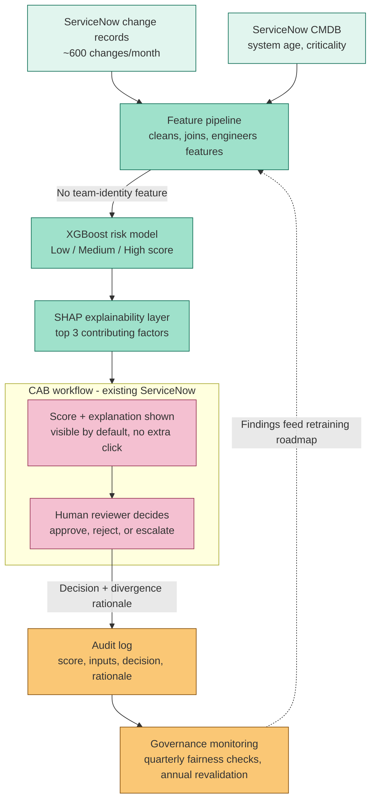

# Architecture Diagram

**ChangeGuard AI — Predictive Risk Scoring for Change Advisory Board Decisioning**

> Reflects the Stage 3 Architecture Decision Record (XGBoost over a deep learning ensemble, chosen for explainability) and the Stage 6 human-in-the-loop deployment design. See the [README](./README.md) for full project context, [03-Scope-Statement.md](./03-Scope-Statement.md) for the human-in-the-loop design requirements this architecture implements, and [12-Budget.md](./12-Budget.md) for the run-cost line items tied to each component below.

---

## System Architecture

*(GitHub renders Mermaid diagrams natively in `.md` files — no image export needed. If viewing this file outside GitHub, paste the code block into [mermaid.live](https://mermaid.live) to render it.)*

---

## Component Breakdown

| Component | Role | Linked Decision |
|---|---|---|
| **ServiceNow change records** | Primary modeling dataset — ~21,000 historical records over 3 years, ~600 active changes/month | [Business Case](./02-Business-Case.md) — data source identified at discovery |
| **ServiceNow CMDB** | Supplies system age and criticality metadata, used as legitimate fairness-remediation features | [Risk Register](./08-Risk-Register.md) RR-02 — added specifically to explain disparity without using team identity |
| **Feature pipeline** | Cleans, joins, and engineers features from both sources; explicitly excludes submitting-team identity as a direct input | [Scope Statement](./03-Scope-Statement.md) — "No use of submitting-team identity as a direct model feature" |
| **XGBoost risk model** | Produces the Low / Medium / High classification | Stage 3 Architecture Decision Record — gradient-boosted trees chosen over a more accurate deep learning ensemble for a materially shorter, more certain Model Risk Validation path |
| **SHAP explainability layer** | Generates per-prediction, plain-language feature attribution | PRD requirement (Stage 2) — explainability had to be reviewable by a non-technical CAB member |
| **CAB workflow (ServiceNow, existing)** | Score and explanation surfaced natively, no separate tool or login | Charter — "In Scope (v1)": surfaced inside the existing ServiceNow CAB workflow |
| **Audit log** | Captures every score, its inputs, the reviewer's final decision, and any divergence rationale | PRD requirement — auditability |
| **Governance monitoring** | Quarterly disparity checks across business units, annual full model revalidation | [Risk Register](./08-Risk-Register.md) RR-11, RR-12 — mandatory conditions of continued production use |

---

## Why This Architecture (Not the Alternatives)

Three architecture options were formally compared in Stage 3, with Model Risk Validation involved before any engineering effort was committed:

| Option | Accuracy | Explainability | Validation Path |
|---|---|---|---|
| Deep learning ensemble | Highest | Difficult — limited validation support | Long, uncertain |
| **XGBoost + SHAP (selected)** | Slightly lower | Strong — native per-prediction SHAP support | Materially shorter, more certain |
| Third-party SaaS vendor | Unknown / vendor-dependent | Limited — vendor black box | Not viable — ruled out on compliance grounds |

**XGBoost with SHAP-based explainability was selected**, accepting a small, known accuracy trade-off in exchange for a faster, more certain path through Model Risk Validation — and because it produces the kind of per-prediction, plain-language explanation CAB members actually need to use the score responsibly rather than defer to it blindly. See the full reasoning in [09-Sprint-Plan.md](./09-Sprint-Plan.md) (Sprints 4–5) and [08-Risk-Register.md](./08-Risk-Register.md) RR-03.

---

## Human-in-the-Loop Design Reflected in This Architecture

- The model output stops at "score + explanation" — it never reaches a system that can approve or reject a change. The human reviewer node is a hard architectural boundary, not just a policy statement.
- The top three contributing factors are wired to display by default inside the existing CAB workflow, rather than being available only on request — a deliberate mitigation against rubber-stamping (see [Risk Register](./08-Risk-Register.md) RR-05).
- The divergence-rationale field flows into the same audit log as the score itself, so over-trust and under-trust patterns are detectable from the data the architecture already captures, not from a separate monitoring system bolted on after the fact.

---

## Forward-Looking Note

The dashed feedback line from governance monitoring back to the feature pipeline represents the retraining feedback loop explored as a forward-roadmap item in [Stage 7 governance](./03-Scope-Statement.md#forward-roadmap-explicitly-deferred-items) — not yet built in v1, but reflected here as the architecture's intended extension point.

---

*Part of the [ChangeGuard AI](./README.md) case study by Prachi Sharma.*
